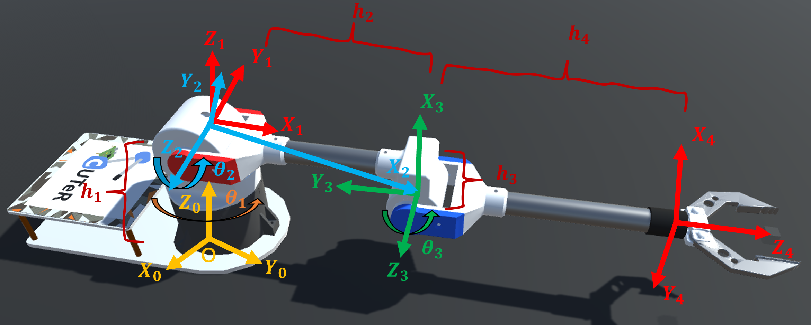
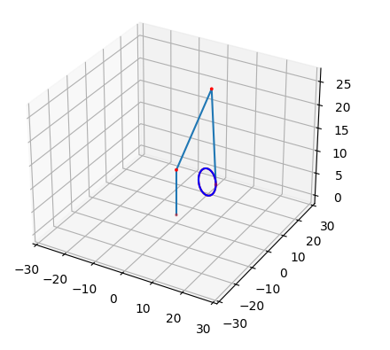
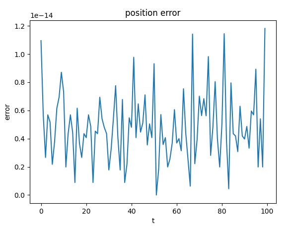
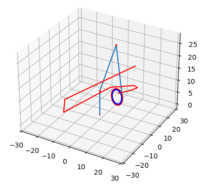
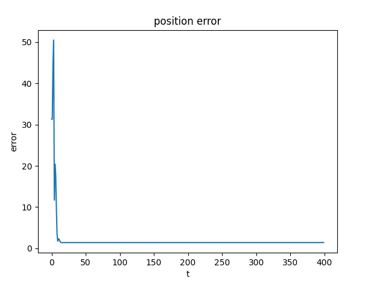
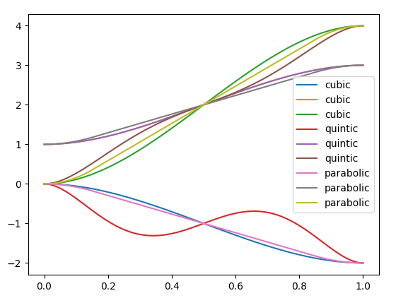

# 3-DoF Robot Arm Simulation and Trajectory Planning
This project involves a 3-DoF robot arm forward & inverse kinematics simulation and trajectory planning. 

## Coordinates Definition under D-H Method
A 3-DoF robot arm is given as follows:

<p align="center">
    
</p>

## Forward Kinematics
The FK is designed to simulate robot arm movement. 

```math
_0^1T=\left[\begin{matrix}- \sin{\left(\theta_{1} \right)} & - \cos{\left(\theta_{1} \right)} & 0 & 0\\\cos{\left(\theta_{1} \right)} & - \sin{\left(\theta_{1} \right)} & 0 & 0\\0 & 0 & 1 & h_{1}\\0 & 0 & 0 & 1\end{matrix}\right]
```

```math
_1^2T=\left[\begin{matrix}\cos{\left(\delta_{\theta} - \theta_{2} \right)} & \sin{\left(\delta_{\theta} - \theta_{2} \right)} & 0 & 0\\0 & 0 & -1 & 0\\- \sin{\left(\delta_{\theta} - \theta_{2} \right)} & \cos{\left(\delta_{\theta} - \theta_{2} \right)} & 0 & 0\\0 & 0 & 0 & 1\end{matrix}\right]
```

```math
_2^3T=\left[\begin{matrix}- \sin{\left(\delta_{\theta} + \theta_{3} \right)} & - \cos{\left(\delta_{\theta} + \theta_{3} \right)} & 0 & \sqrt{h_{2}^{2} + h_{3}^{2}}\\\cos{\left(\delta_{\theta} + \theta_{3} \right)} & - \sin{\left(\delta_{\theta} + \theta_{3} \right)} & 0 & 0\\0 & 0 & 1 & 0\\0 & 0 & 0 & 1\end{matrix}\right]
```

```math
_3^4T=\left[\begin{matrix}1 & 0 & 0 & 0\\0 & 0 & -1 & - h_{4}\\0 & 1 & 0 & 0\\0 & 0 & 0 & 1\end{matrix}\right]
```

## Inverse Kinematics
The IK is designed for task space trajectory tracking. In this project, we deployed both analytical and numerical IK. The analytical method gives lower tracking errors while requiring more computational resources. The numerical method runs faster while it may fall into a local optimum.

<p align="center">
    Trajectory of analytical IK<br><br>
    
</p> 
<p align="center">
    Position error for analytical IK<br><br>
    
</p> 

<p align="center">
    Trajectory of numerical IK<br><br>
    
</p> 
<p align="center">
    Position error for numerical IK<br><br>
    
</p>

## Trajectory Planning
Trajectory planning involves three types of curves, which are cubic, quintic and parabolic. The higher order curve we use, the smooth the trajectory will be.

<p align="center">
    
</p>
